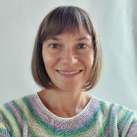

# Ekaterina Trifonova

## Frontend developer



---

## Contact

- Tel: [+7 (926) 342-09-22](tel:+79263420922 "+7 (926) 342-09-22")
- WhatsApp: [+7 (926) 342-09-22](https://wa.me/+79263420922 "WhatsApp")
- Telegram: [@trifonova_ekaterina](https://t.me/trifonova_ekaterina "@trifonova_ekaterina")
- Email: [3420922@gmail.com](mailto:3420922@gmail.com "3420922@gmail.com")

---

## About

Since September 2021, I have been actively immersed in frontend development, learned the basics of working with Git, started writing logic in Javascript, got acquainted with Vue.js, started using Webpack and Gulp to build projects, improved my page layout skills. Presently I'm taking an advanced frontend development course from The Rolling Scopes School and improving my knowledge of technical English.

At the moment, my favorite development tool is Vue.js, I like how the framework organizes the logic of the code and ensures the stability of the deployed application.

---

## Hard skills

- Vue.js
- Javascript
- HTML
- CSS
- SASS
- SCSS
- Git
- Webpack
- Gulp
- BEM
- jQuery
- Bootstrap
- Axios

---

## Soft skills

- Discipline
- Adaptability
- Collaboration
- Problen solving
- Self-confidence

---

## Сode examples

### Function from Momentum task of the stage 0

```
function playAudio() {
    const play = document.querySelector(".play");
    if (!isPlaying) {
    isPlaying = true;
    audio.src = playList[currentTrack].src;
    currentTrackName = playList[currentTrack].title;
    const currentTrackContainer = document.querySelector(".player__track-name");
    currentTrackContainer.textContent = currentTrackName;
    audio.currentTime = currentTime;
    audio.play();
    audio.addEventListener("loadeddata", showTrackDuration);
    play.classList.add("pause");
    audio.addEventListener("ended",nextTrack);
    const items = document.querySelectorAll(".play-pro-item");
    [...items].forEach(el=> {
        if (el.innerText === currentTrackName) {
            el.classList.add("item-active");
            el.classList.toggle("item-pause");
        } else {
            el.classList.remove("item-active");
            el.classList.remove("item-pause");
        }

    });
    } else {
        pauseAudio();
        
    }
}
```

### CodeWars kata

```
function rgb(r, g, b){
  let result = "";
  [...arguments].forEach(function(color) {
    color=color<0 ? 0 : color;
    color=color>255 ? 255 : color;
    let hexString = color.toString(16);
    if (hexString.length===1) {
      hexString ="0" + hexString;
    }
    result +=hexString;
  }) 
  return result.toUpperCase();
}
```

---

## Work experience

### **September 2021 - to present: Frontend developer**, freelance.

Learned the basics of Javascript, Vue.js, Typescript, Git.

Honed my practice on simulators:

- https://en.hexlet.io
- https://htmlacademy.ru/
- https://codepip.com/
- https://www.codewars.com/users/ekatrif

Made 6 pet projects:

1. Vote for the film of the week - https://github.com/ekatrif/films-rating
2. Speaker time control - https://github.com/ekatrif/spiker-time-control
3. CV page - https://github.com/ekatrif/Pet-project
4. Product page - https://github.com/ekatrif/funbox-test-task
5. Online store page with a shopping cart - https://github.com/ekatrif/online-shop-prototype
6. Online store prototype - https://github.com/ekatrif/1146-Edu-project

### **2010 - 2021: Web developer**, freelance.

- Performed tasks for two web-studios and directly for business.

- Developed more than 40 sites on CMS (Wordpress, Modx, Prestashop, etc.) - a full cycle from the preparation of technical specifications to the implementation of the finished product.

- Improved the interface and functionality (based on standard modules) for 100+ sites.

- Optimized page loading speed for 20+ sites.

- Transferred more than 100 sites to a new hosting.

- Made more than a dozen content plans for filling sites, accepted texts from a team of copywriters and published them on resources.

- Set up contextual advertising in Yandex.Direct and Google.Adwords for 10+ clients.

- Created several networks of sites and improved their visibility in search engines.

---

## Education

**2001-2007 Engineer degree**, Bauman Moscow State Technical University, Faculty of Special Mechanical Engineering.

**2021 Frontend developer**, Training center "Professional", Frontend development.

**2021-2022** RollingScopes School stage 0, have a certificate.


**2022** RollingScopes School stage 1, in the process.

---

## Languages

**Russian**: native

**English**: B1-B2

**French**: B2
